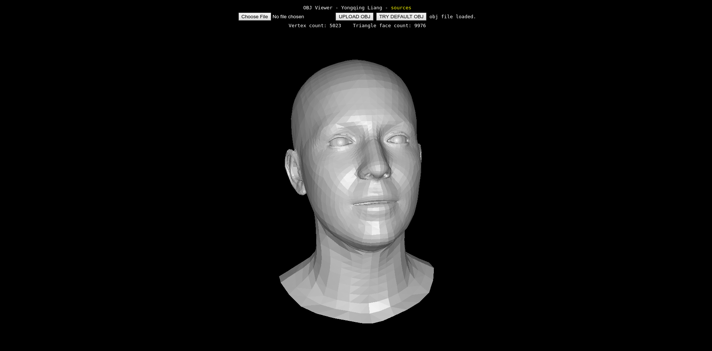

# OBJ Viewer

Online demo: [http://xmlyqing00.github.io/OBJViewer](http://xmlyqing00.github.io/OBJViewer). 

This project is based on [three.js](https://github.com/mrdoob/three.js)

## Usage

Click `TRY DEFAULT OBJ` or upload your `*.obj` file. Drag mouse or scroll to view the 3D object. 

## LICENSE
MIT

If you use this repository in your project, please cite this page.